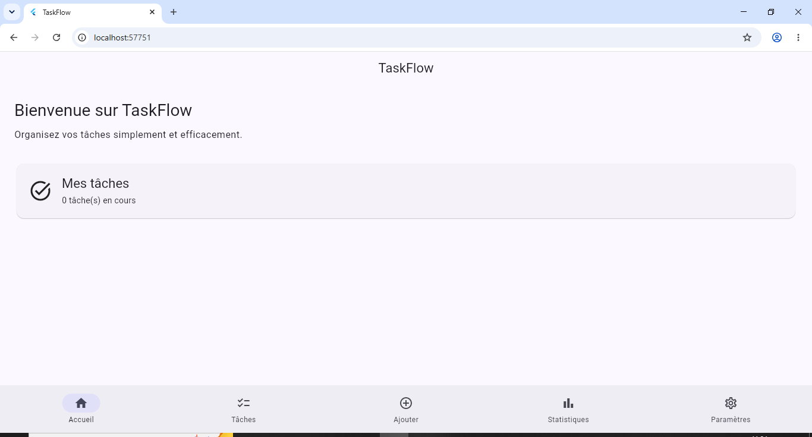
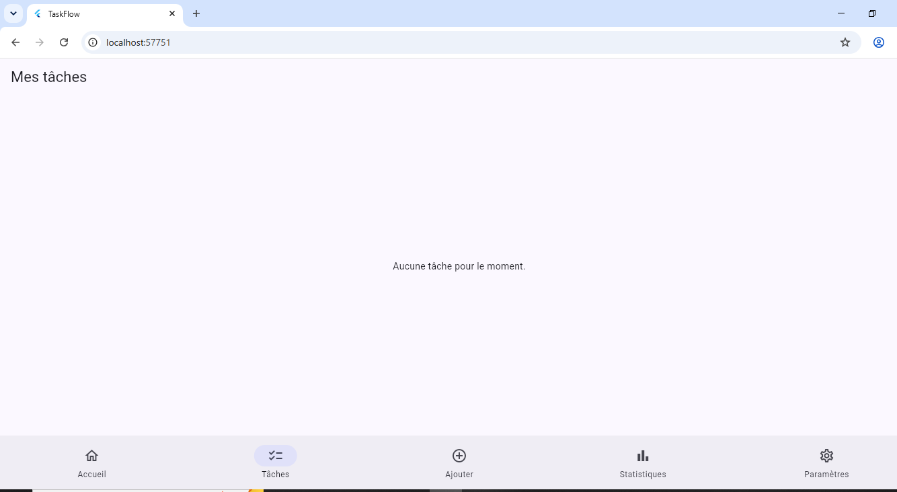
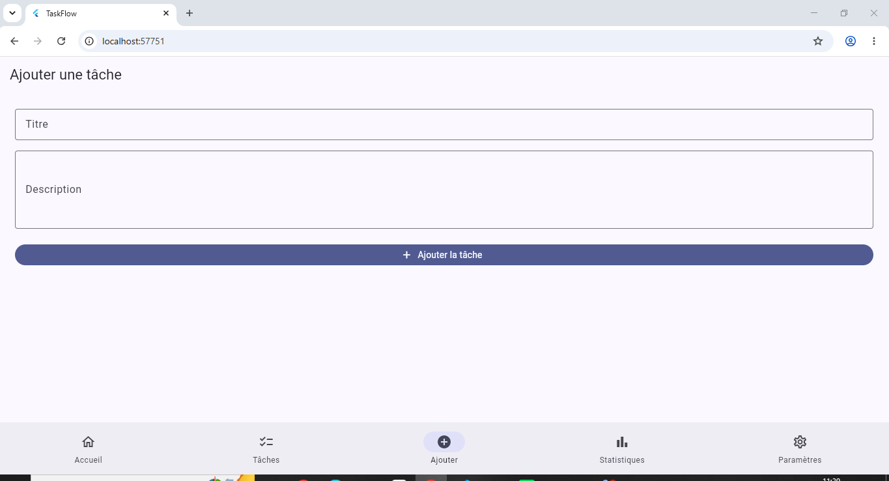
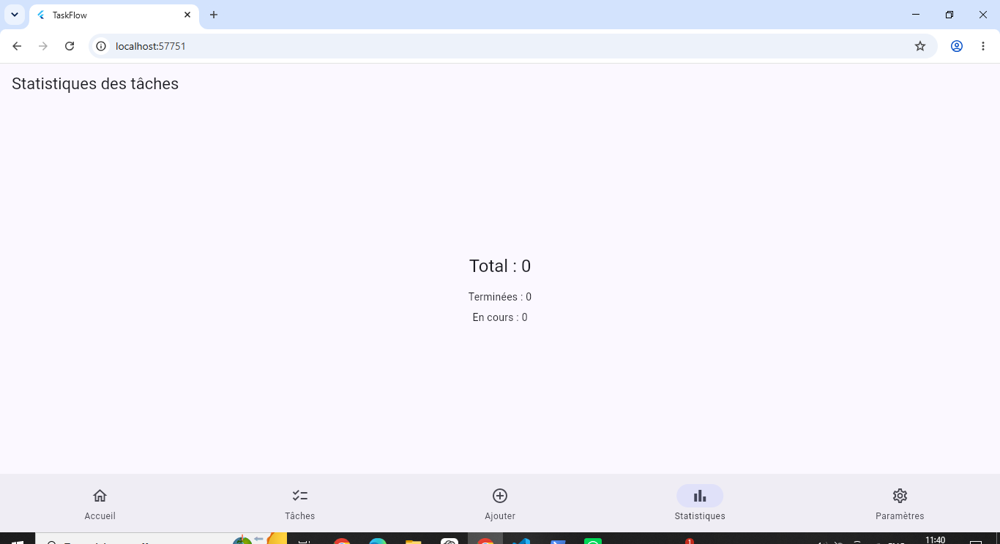
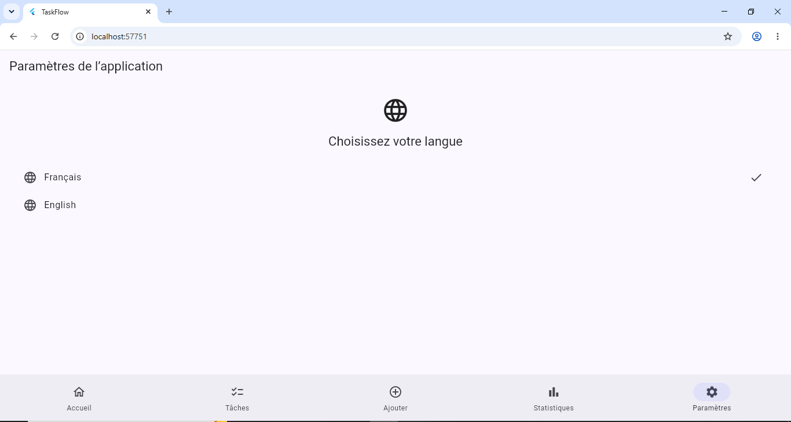

# TaskFlow
[](https://github.com/angenicolen/production_ready_app/actions/workflows/ci.yml)

TaskFlow est une application Flutter de gestion de tâches conçue avec une approche orientée vers la qualité, les tests et la préparation à la production.

## Fonctionnalités

- Affichage d'un tableau de bord d'accueil
- Création de tâches
- Affichage de la liste des tâches
- Marquage d'une tâche comme terminée ou non terminée
- Suppression de tâches
- Statistiques sur les tâches terminées et en attente
- Changement de langue entre français et anglais
- Navigation entre cinq écrans
- Validation des formulaires
- Support de l'accessibilité avec des labels sémantiques
- Utilisation de widgets `const` lorsque cela est possible

## Écrans

L'application contient cinq écrans principaux :

1. Accueil
2. Mes tâches
3. Ajouter une tâche
4. Statistiques
5. Paramètres
## Architecture

Le projet utilise une structure simple et organisée :

```text
lib/
├── main.dart
├── localization/
│   └── app_texts.dart
├── models/
│   └── task.dart
├── screens/
│   ├── home_screen.dart
│   ├── tasks_screen.dart
│   ├── add_task_screen.dart
│   ├── statistics_screen.dart
│   └── settings_screen.dart
└── services/
    └── task_service.dart
```

- `localization/` contient les textes utilisés pour le français et l'anglais.
- `models/` contient les modèles de données.
- `screens/` contient les écrans de l'application.
- `services/` contient la logique de gestion des tâches.
- `main.dart` contient la configuration de l'application et la navigation principale.
## Tests

Le projet comprend plusieurs niveaux de tests :

- **10 tests unitaires** pour le modèle `Task` et le service `TaskService`
- **6 tests de widgets** pour vérifier le comportement de l'interface
- **2 tests d'intégration** pour vérifier les parcours utilisateur

Les tests classiques sont exécutés avec :

```bash
flutter test
```

Pour exécuter les tests d'intégration :

```bash
flutter test integration_test
```

## Qualité du code

L'analyse statique du projet est effectuée avec :

```bash
flutter analyze
```

Le projet doit rester sans erreurs ni avertissements avant chaque livraison.

## Internationalisation

TaskFlow prend en charge deux langues :

- Français
- English

L'utilisateur peut changer de langue depuis l'écran Paramètres.

## Accessibilité

Les éléments interactifs importants de l'application utilisent des informations sémantiques afin de faciliter leur utilisation avec les technologies d'assistance.

## Performance

L'application privilégie :

- Les widgets `const` lorsque cela est possible
- Une structure simple limitant les reconstructions inutiles
- L'affichage des tâches avec une liste adaptée aux performances

L'application n'utilise pas d'images distantes ou lourdes nécessitant une optimisation particulière.

## Installation

### Prérequis

- Flutter
- Dart
- Google Chrome pour les tests d'intégration

### Installation

Cloner le dépôt :

```bash
git clone https://github.com/angenicolen/production_ready_app.git
```

Entrer dans le projet :

```bash
cd production_ready_app
```

Installer les dépendances :

```bash
flutter pub get
```

Lancer l'application :

```bash
flutter run
```

Pour lancer l'application sur Chrome :

```bash
flutter run -d chrome
```

## Vérification

Avant de publier une nouvelle version, exécuter :

```bash
flutter analyze
flutter test
```

Puis vérifier les tests d'intégration.

## CI/CD

Le projet utilise **GitHub Actions** pour automatiser l'analyse du code et l'exécution des tests à chaque modification du dépôt.

Le workflow CI exécute notamment :

- `flutter pub get`
- `flutter analyze`
- `flutter test`

## Captures d'écran

### Accueil



### Mes tâches



### Ajouter une tâche



### Statistiques



### Paramètres



## Technologies utilisées

- Flutter
- Dart
- Flutter Test
- Integration Test
- GitHub Actions

## Versions

Les principales évolutions du projet sont documentées dans le fichier `CHANGELOG.md`.

## Licence

Ce projet a été réalisé dans le cadre d'un projet Flutter de formation.
